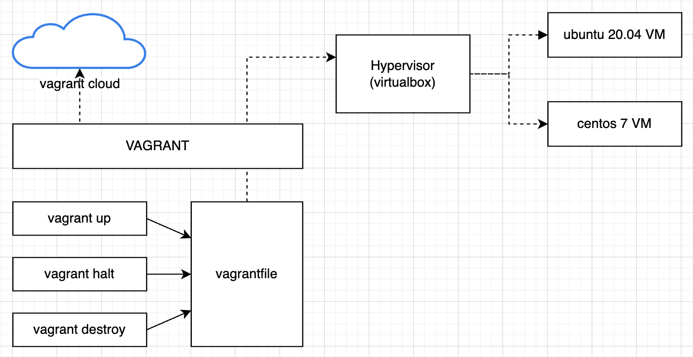

# Using Vagrant to provision linux VM servers

## The architecture

## Using Vagrant to automate the installation ubuntu 20.04 in VirtualBox

- Installing VirtualBox
- Installing Vagrant
- Create ubuntu and centos VM Automatically
- Provisioning
- Multi VM Vagrantfile

Vagrant is a VM automation tools

## The Project :

Using Vagrant to automate the creation of Ubuntu Virtual Server using VirtualBox

## The Vagrant Setup:

- Make sure VT is enabled in the BIOS
- Make sure The vagrant tools is install on your computer
- Make sure the VirtualBox (the Hypervisor) install
- For CLI we are using git

## VM setup with Vagrant

- Look for a vagrant virtual box at app.vagrantup.com/boxes/search
- Create a project directory
- Create vagrantfile
- Issue the "vagrant up" command to bring the VM
- Use ssh to connect to the

## Create a project directory

- mkdir DevOps
- cd DevOps
- mkdir vagrant
- cd vagrant
- mkdir ubuntu20.04
- mkdir centos7

## Create the vagrantfile

- cd centos7
- go to https://app.vagrantup.com/boxes/search
- search for centos minimal
- choose geerlingguy/centos7
- copy geerlingguy/centos7 (that the os version we are using)
- from the centos7 folder type vagrant init geerlingguy/centos7
- This creates the Vagrantfile in the centos7 directory
- type the command vagrant up (download cent07 box and starts centos)

## Connect to centos server

- cd centos7
- vagrant ssh (to connect to the centos server)
- you will be in the linux command prompt
- type this command to see who you are login at whoami
- type this command to shutdown the server vagrant halt

## Exercise for visitors

- create a VM for ubuntu 20.04
- connect to the ubuntu server
- issue the linux command to see who you are login as
- shutdown the VM
- delete the vm
